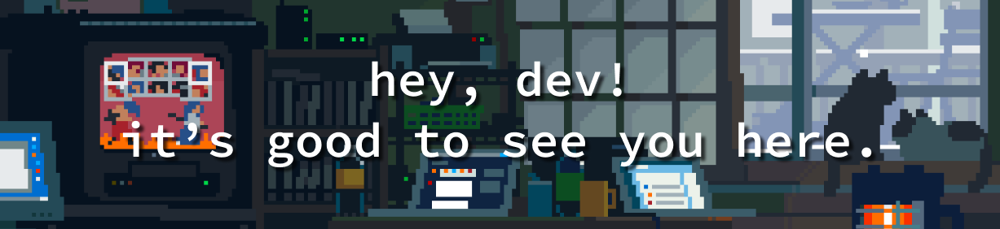

  

<!--## ✨ Hey, Dev! It’s good to see you here. ✨-->
##

### ✨You can call me Bia!✨

    
    📌 I'm twenty years old, I live in Brazil 
    and I'm a beginner front-end developer!

    I've been exploring this world for a few weeks now. 
    I learn something new every day... 
    And I discover a new bug every 3 lines of code... 🤭

  

##

<!--

-->

### I'm learning:

 
  
  
  
  
  
  
  
  
  
  
  
  
  

##

### I’m working on a 20 days intensive focused on JavaScript and React! 

##

#### I'm probably now trying to fix bugs that I created when trying to fix another bug HAHA!

  

But you can message me!  
Find me on linkedin or send me an email: 
  

 
  
   

 

